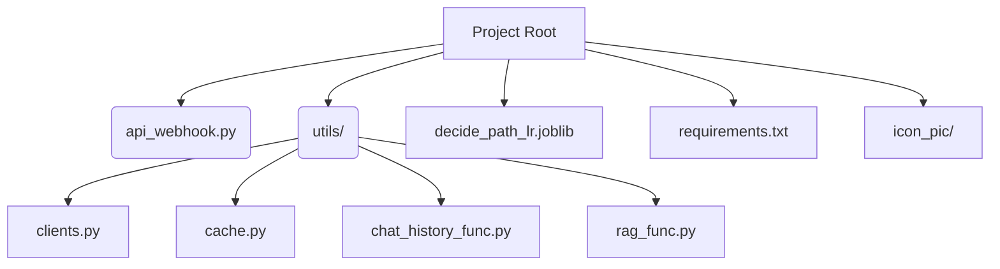

# 🧠 LINE RAG API

_A retrieval‑augmented chatbot for LINE that helps insurance customers get concise answers from proprietary knowledge bases._

  

## 📑 Table of Contents

- [📄 Description](#-description)
  - [✨ Key Features](#-key-features)
- [🗂️ Repository Structure](#-repository-structure)
- [🛠️ Installation](#-installation)
  - [For Users](#for-users)
  - [For Developers](#for-developers)
- [🚀 Usage & Workflow](#-usage--workflow)
- [⚙️ Architecture](#-architecture)
- [🧪 Data‑Science Highlights](#-data-science-highlights)
- [🙌 Contributing](#-contributing)
- [👤 Author](#-author)

---

## 📄 Description

`Insurance-LINE-Chatbot` is a production‑grade retrieval‑augmented generation (RAG) service that powers a LINE messaging chatbot for an insurance provider.  It combines modern **FastAPI** web services, **asynchronous concurrency**, **vector search** over Azure Cognitive Search and **large‑language models** (OpenAI & Google Gemini) to deliver up‑to‑date answers from internal knowledge bases.  Conversations are cached for seamless multi‑turn interactions and stored for analytics.

The pipeline works as follows:

1. **Message buffering.**  Incoming LINE messages are stored in a **memcached** buffer for a configurable window.  This prevents spamming the API when users type multiple messages quickly.  The webhook initialises a thread pool and retrieves a memcache client from `utils.cache.get_memcache()`.
2. **Intent classification.**  When the buffer expires, the concatenated user messages are classified using a small logistic‑regression model or a prompt‑engineered Gemini classifier.  The classifier labels queries as `INSURANCE_SERVICE`, `INSURANCE_PRODUCT`, `CONTINUE CONVERSATION`, `MORE` or `OFF‑TOPIC` with detailed guidelines and examples.
3. **Vector retrieval.**  Based on the predicted label, the API issues a **vector search** against either a service index (3 documents) or a product index (7 documents).  The thread‑safe Azure Cognitive Search clients are created on demand in `utils/clients.py`.
4. **Answer generation.**  The retrieved context, conversation history and user question are passed to an LLM (OpenAI/Gemini) with a system prompt that forbids hallucination.  Predefined FAQs are served instantly from a cache.
5. **Reply and persistence.**  The answer is sent back through the LINE Messaging API with quick‑reply buttons.  Conversation turns and the chosen path are saved in MongoDB for future context and analytics.

### ✨ Key Features

- **Retrieval‑augmented generation:** Combines document retrieval with LLM‑powered answer synthesis.
- **Intent classification:** Uses both prompt‑engineered classification and a logistic‑regression model to decide the retrieval path.
- **Asynchronous FastAPI:** High throughput via `asyncio`, a shared thread pool and an HTTPX async client with retry logic.
- **Stateful conversations:** Memcached buffers group messages; MongoDB stores chat history and path decisions.
- **Pluggable clients:** Modular functions create Azure Search, OpenAI, Gemini and LINE API clients.
- **Multilingual support:** Prompts include Thai and English examples for clear classification and responses.

---

## 🗂️ Repository Structure



| Path                         | Description                                                                                                                                                                          |
| ---------------------------- | ------------------------------------------------------------------------------------------------------------------------------------------------------------------------------------ |
| `api_webhook.py`             | Main FastAPI application.  Handles the LINE webhook, buffers messages, runs the RAG pipeline and replies via the LINE API.  Contains FAQ answers and quick‑reply button definitions. |
| `utils/clients.py`           | Factories for Azure Search, OpenAI/Gemini and LINE API clients.                                                                                                                      |
| `utils/cache.py`             | Memcached client using environment variables.                                                                                                                                        |
| `utils/chat_history_func.py` | Retrieves, summarises and persists chat history in MongoDB.                                                                                                                          |
| `utils/rag_func.py`          | Contains classification prompts, response prompts and functions to decide the retrieval path, summarise context, search and generate answers.                                        |
| `decide_path_lr.joblib`      | Logistic‑regression model to classify user queries into retrieval paths.                                                                                                             |
| `icon_pic/`                  | PNG icons used in quick‑reply buttons.                                                                                                                                               |
| `requirements.txt`           | Python dependencies.                                                                                                                                                                 |
---

## 🛠️ Installation

**For Users** 

<pre> ```bash pip install -r requirements.txt ``` </pre>

Create a .env file and set your LINE credentials (LINE_CHANNEL_SECRET, LINE_CHANNEL_ACCESS_TOKEN), Azure Search keys (AZURE_SEARCH_ENDPOINT, AZURE_SEARCH_KEY, AZURE_SEARCH_INDEX, AZURE_SEARCH_INDEX_INSURANCE_SERVICE), OpenAI/Gemini API keys, memcached connection parameters and MongoDB connection strings. Then run:

<pre> ```bash uvicorn api_webhook:app --host 0.0.0.0 --port 8000 ``` </pre>

Expose /callback to your LINE bot’s webhook URL.


